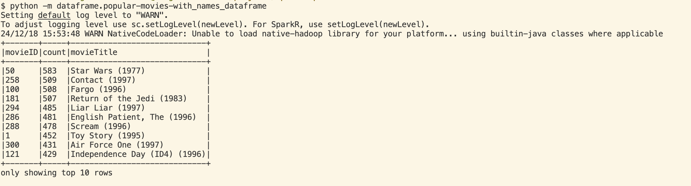

### Errors
#### ImportError: attempted relative import with no known parent package
#### ImportError: attempted relative import beyond top-level package
#### Error while finding module specification
##### Error while finding module specification for 'dataframe.popular-movies-with_names_dataframe.py' (ModuleNotFoundError: __path__ attribute not found on 'dataframe.popular-movies-with_names_dataframe' while trying to find 'dataframe.popular-movies-with_names_dataframe.py'). Try using 'dataframe.popular-movies-with_names_dataframe' instead of 'dataframe.popular-movies-with_names_dataframe.py' as the module name.

### Solution:

Change project structure, add `__init__.py`:

```
project/
│
├── helpers/
│   ├── __init__.py
│   ├── dict_movie_names.py
│
├── dataframe/
│   ├── __init__.py
│   ├── popular-movies-with_names_dataframe.py
```

Import `dict_movie_names`:

```python
from helpers.dict_movie_names import loadMovieNames, getLookupFunctionForDict
```

Run script:
```bash
python -m dataframe.popular-movies-with_names_dataframe
```

