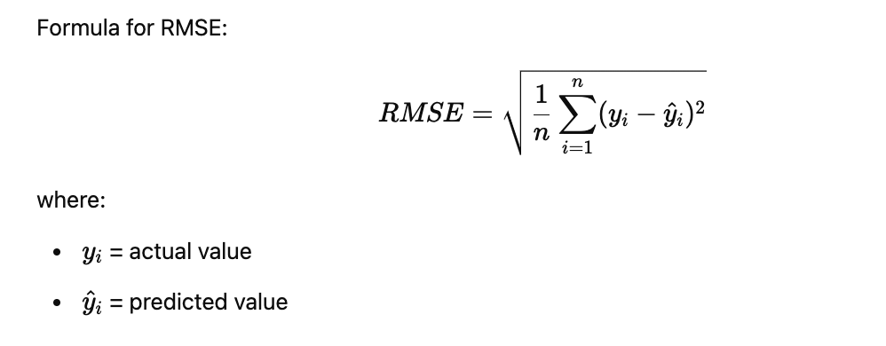

# Overview

In this folder I experiment with three machine learning models available in Spark library plus use some technics to minimize error.

To calculate error I use `metricName="rmse"`  -  Root Mean Squared Error (RMSE) as the evaluation metric. RMSE measures the average error in predictions and gives more weight to large errors.



A *lower RMSE* means the model predictions *are closer* to the actual values ( = better model)

Other possible metrics: "mae" (Mean Absolute Error), "mse" (Mean Squared Error), "r2" (R-squared) – measures how well the model explains variance in the data (1.0 means perfect prediction).


## Decision Tree

A Decision Tree is a simple machine learning model that makes decisions by splitting data based on feature values.

How it works: starts at a root node and splits data at each step based on the most important feature.
Splits continue until a stopping condition is met (e.g., `max depth`, `min instances per node`).
The result is a tree-like structure that makes predictions.

```
python ml/decision-tree-regression.py
```

Executions result:
```
Root Mean Squared Error (RMSE): 8.0700465927444
Model Training Execution Time: 2.09 seconds
```


## Decision Tree Regression with CrossValidator on ParamsGrid:

I use grid search & cross validation to find the best hyperparameters.

When set `numFolds=X`:
- the dataset is randomly divided into X subsets (folds).
- the model is trained using 4 subsets and tested on the remaining 1 subset.
- this step is repeated 5 times, each time using a different fold as the test set.
- compute the Average Performance -> fter all iterations, the model’s performance (e.g., RMSE) is averaged across all folds to get a final evaluation score.

when use `ParamGridBuilder` - define grip of parameters (variables) to use in your model training

```
python ml/decision-tree-regression-with-crossvalidator.py
```

Executions result:
```
Best maxDepth: 3
Best minInstancesPerNode: 5
Best maxBins: 64
Root Mean Squared Error (RMSE): 7.447789822244204
Model Training Execution Time: 1.27 minutes
```

## Gradient Boosting Trees with CrossValidator on ParamsGrid:

A GBT Model builds trees sequentially, with each tree correcting the errors of the previous one.
How it works:

First, train a Decision Tree → It makes some mistakes.
Train a second tree on the errors (residuals) of the first tree.
Continue adding trees until improvements stop.
Final prediction = Sum of all trees with weights.

Should achieve the best accuracy possible comparing with Decision Tree and Random Forest

```
python ml/gbt-regressor-with-crossvalidator.py
```

Results

```
Best maxDepth: 3
Best maxBins: 16
Best maxIter: 50
Root Mean Squared Error (RMSE): 6.676533775071076
Model Training Execution Time: 3.18 minutes
```

## Gradient Boosting Trees with sampling for better splits

I prepared fractions to ensure that each price range (low, medium, high) is equally represented in train & test data.

```bash
python ml/gbt-regressor-with-stratified-crossvalidator.py
```

Results:
```
Best maxDepth: 3
Best maxBins: 16
Best maxIter: 10
Root Mean Squared Error (RMSE): 7.159653191811454
Model Training Execution Time: 3.60 minutes
```

## Gradient Boosting Trees with sampling and scaler

Scales features between 0 and 1 to improve GBT performance


```
python ml/gbt-regressor-sampling-cross-validator-min-max-scaler.py
```


Executions result:
```
Model Training Execution Time: 1125.58 seconds
Root Mean Squared Error (RMSE): 6.973901944593233
```
