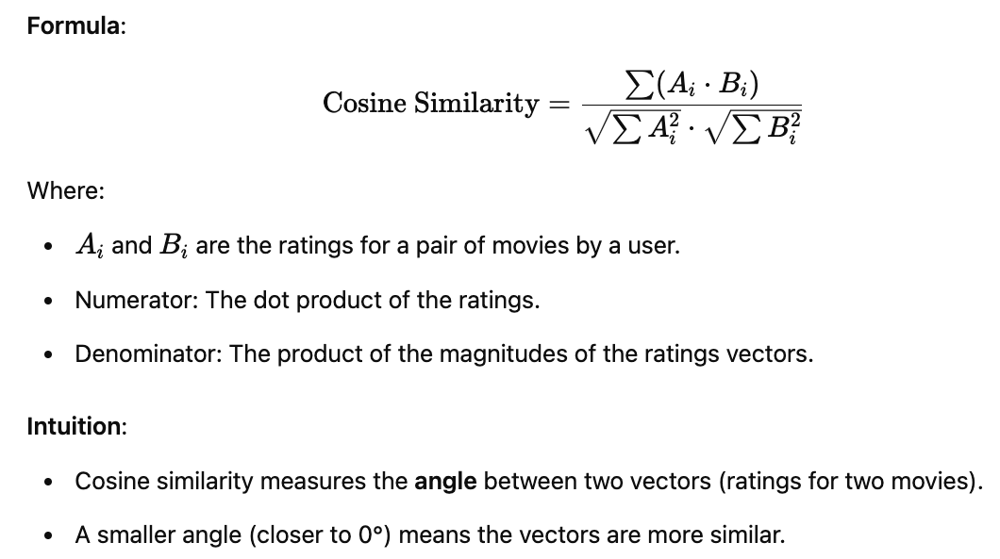
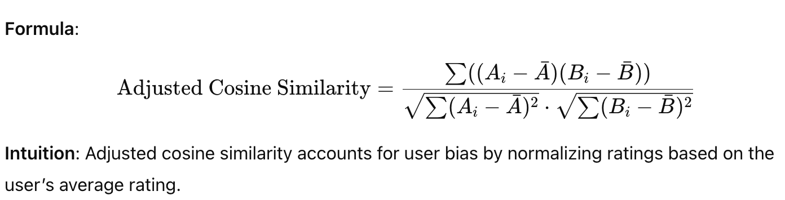
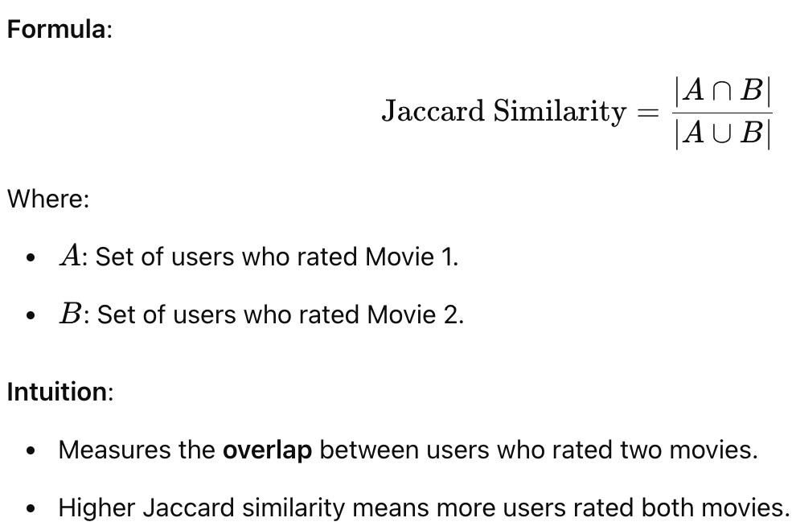

# Overview

In this folder I experiment with three similarity metrics for movies recommendation: 

## Pearson Correlation
Measures linear relationship, less sensitive to scale differences (it focuses on the relationship or pattern of ratings rather than their absolute value, due to normalization, it effectively "standardizes" the ratings for each item).

#### Execution script:
```
python -m recommendation_algorithms.movies_pearson_similarity 50
```

#### Theory:


Result (first 5) on `scoreThreshold = 0.5` and `numberOfSharedRatings = 100`:


#### Execution results
Result (first 10) on `scoreThreshold = 0.3` and `numberOfSharedRatings = 100`:


#### More theory
> What does 'scope' mean?

The Pearson Correlation Coefficient (PCC), referred to as the 'score' in the code, is a statistical measure that evaluates the linear relationship between two variables. In the context of movie recommendation system, it measures the relationship between the ratings of two movies by the same group of users.

in formula


The numerator captures how much A and B "move together" (covariance), and the denominator normalizes by the standard deviation of both variables.


The Pearson Correlation coefficient is bounded between -1 and 1.

- A score close to 1 indicates a strong positive correlation, meaning that as the rating for one movie increases, the rating for the other movie also increases in a linear fashion. If two movies have a high positive correlation (e.g., `𝑟 = 0.8`), it means that users who liked one movie generally liked the other as well. These movies have similar rating patterns across users
- A score close to -1 indicates a strong negative correlation, meaning that as the rating for one movie increases, the rating for the other movie decreases in a linear fashion. If two movies have a high negative correlation (e.g., `𝑟 = −0.7`) it means that users who liked one movie generally disliked the other movie.
- A score of 0 means no linear correlation between the two movies' ratings. It means there is no consistent pattern between the ratings of the two movies across users.

## Cosine Similarity (Adjusted)
Best for basic rating comparisons, especially for cases with user-specific rating behavior - there is a normalization.

#### Execution script:
```
python -m recommendation_algorithms.movies_adjusted_cosine_similarity 50
```

#### Execution results
`scoreThreshold = 0.6` (not really an angle, but a cos(angle between vectors))

`coOccurrenceThreshold = 60` # shared ratings


#### Theory




##  Euclidean Distance

#### Execution script:
```
python -m recommendation_algorithms.movies_euclidean_distance 50
```

#### Execution results
**Results are awful** , not robust enough for movie recommendation tasks.

#### Theory


## Jaccard similarity

#### Execution script:
```
python -m recommendation_algorithms.movies_jaccard_similarity 50
```

#### Execution results
`ratingThreshold = 3` (to include move movies)

`scoreThreshold = 1` (unfortunately, 1 for all in the result top 10 - Star Wars (1977) is too popular and all other movies in the set too)`

`minSharedRatings = 240` (as scope=1 for top resluts, I sorted by shared raitings)


`ratingThreshold = 4` (to include only highly-rated movies, but here we lost some good one like Start Trek and The contact)

`scoreThreshold = 1` (unfortunately, 1 for all in the result top 10 - Star Wars (1977) is too popular and all other movies in the set too)`

`minSharedRatings = 240` (as scope=1 for top resluts, I sorted by shared raitings)


#### Theory
