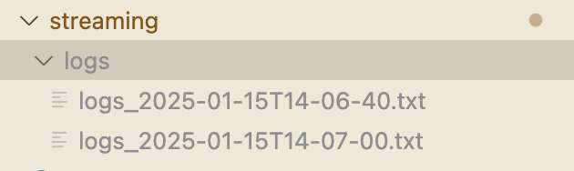
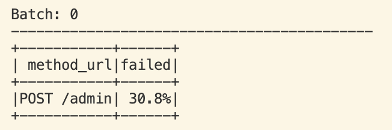
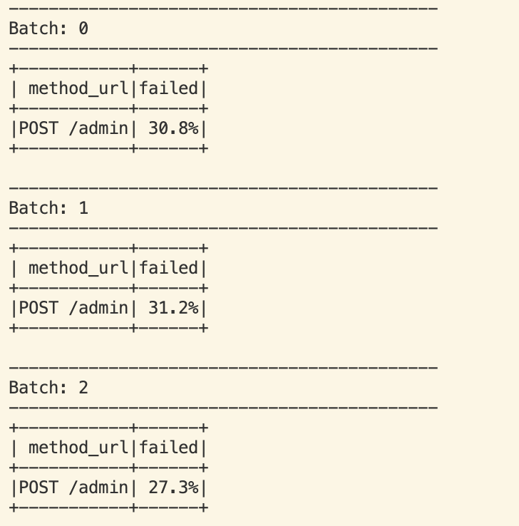
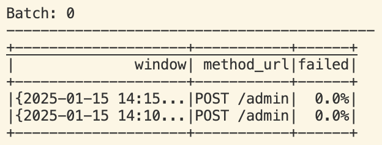
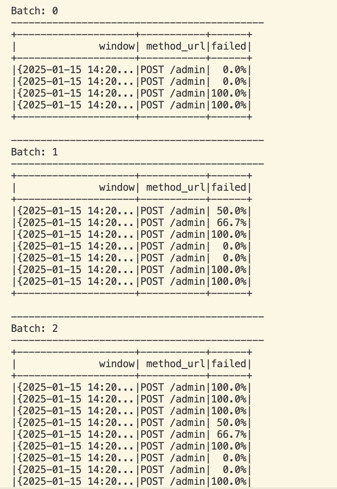

# Spark streaming

#### Get realtime logs
Start log generator script to get log files arriving to the `logs` folder:

```
python streaming/logs_generator.py
```

This script will generate log files with random data:




#### Catch and parse logs
##### Use Spark structured streaming without time window to analyze **all** logs:

```
python streaming/structured_streaming.py
```

This script will  calculate percentage of failed attempts to admin panel to spot security breaches:



Script monitors the folder *streaming/logs* and will re-calculate data each time new log file arrives:




##### Use Spark structured streaming wit time window to analyze chunks of logs:

```
python streaming/structured_streaming_windows.py
```

This script will  calculate percentage of failed attempts to admin panel to spot security breaches within time windows. 



It monitors the folder *streaming/logs* and will re-calculate data each time new log file arrives





